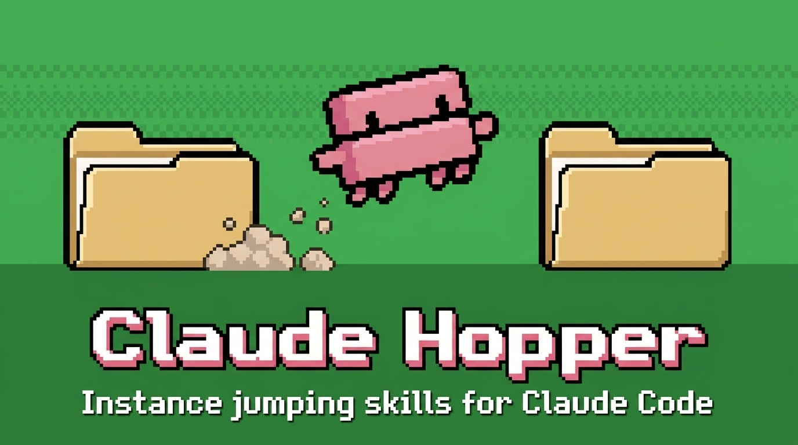

Skills for hopping between discrete terminal-bound Claude Code sessions on Linux. Spawn new instances, hand off context, resume from handovers, and pick up leftover work.

## Skills

**Spawning new sessions**
- `new-claude-here` — open a new Konsole window running a fresh Claude session in the current cwd
- `new-claude-at` — open a new Konsole window running a fresh Claude session at a specified path
- `terminal-here` — open a Konsole at the current directory (no Claude)
- `new-workspace` — scaffold a generic workspace dir from the bundled template

**Handover**
- `handover` — end-of-session menu; logging, YAML handover, follow-up tasks
- `handover-with-tasks` — write a handover doc that includes an open task list
- `clipboard-handover` — short YAML handover printed in chat and copied to clipboard
- `start-from-handover` — open the new session against a previously-written handover

**Leftover work**
- `start-leftover` — pick one or more open items from `planning/leftover-tasks.md` and start them
- `spawn-planning-repo` — create a sibling planning repo, seed it with context

**Side-tasks**
- `sideclaude` — capture a tangent as a plan file and spawn a parallel Claude session to execute it, keeping the current thread clean
- `claude-grid` — launch a Konsole window at a path with 2 or 4 split panes, each running its own fresh Claude session

## Why a separate plugin

Carved out of [Claude-Rudder](https://github.com/danielrosehill/Claude-Rudder) so users who only need session-spawning + handover primitives don't load the full Rudder context surface.

## License

MIT
